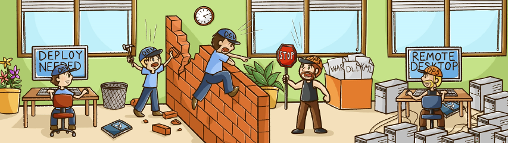
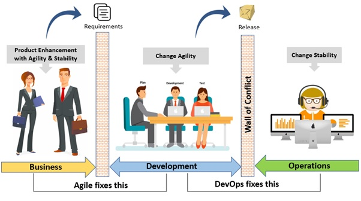
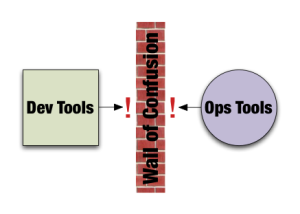
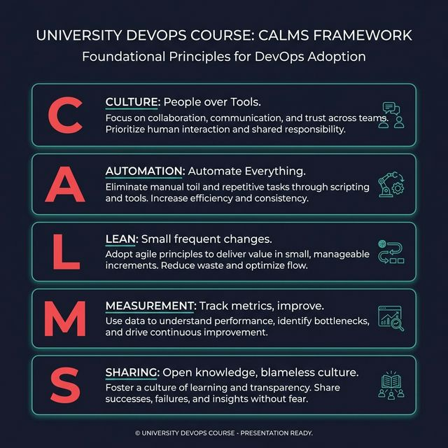
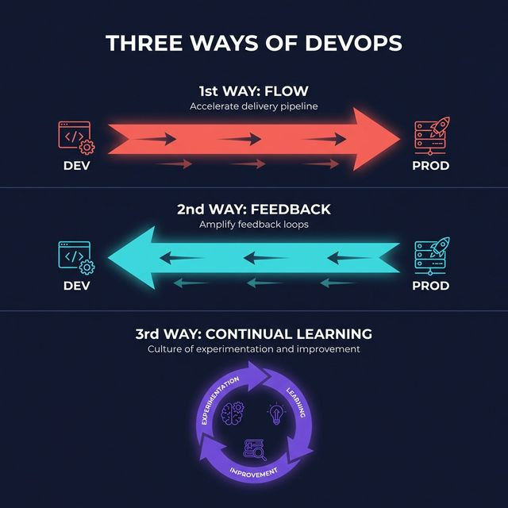
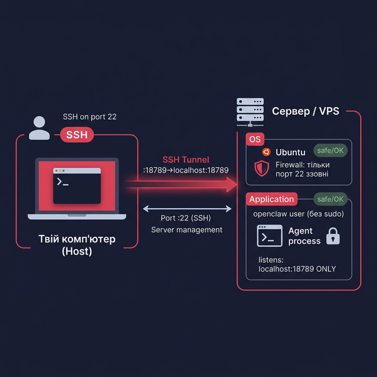

# Основи DevOps

## Модуль 0: Навіщо це все?

**Філософія та принципи DevOps**

---

### Метафора DevOps: Ефект Червоної Королеви

> "Well, in our country," said Alice, still panting a little, "you'd generally get to somewhere else — if you ran very fast for a long time, as we've been doing."
>
> "A slow sort of country!" said the Queen. "**Now, here, you see, it takes all the running you can do, to keep in the same place.** If you want to get somewhere else, you must run at least **twice as fast as that!**"
>
> — *Lewis Carroll, «Through the Looking-Glass»*

---

### Метафора DevOps: Ефект Червоної Королеви

> «Ну, у нас, — сказала Аліса, все ще трохи важко дихаючи, — зазвичай потрапляєш в інше місце, якщо бігти дуже швидко і довго, як ми щойно робили».
>
> «Яка повільна країна! — вигукнула Королева. — **Тут, як бачиш, треба бігти щосили, щоб тільки залишитися на одному місці.** А якщо хочеш потрапити в інше місце, треба бігти принаймні **вдвічі швидше!**»
>
> — *Льюїс Керролл, «Аліса в Зазеркаллі»*

---

### Ефект Червоної Королеви (Red Queen Hypothesis)

**Контекст:** Аліса здивована тим, що після довгого бігу вони залишилися на тому ж місці. Королева пояснює: у Зазеркаллі нерухомість вимагає максимальних зусиль.

**В DevOps:** Щоб система просто *працювала* (стабільність), ми маємо постійно розвиватися та адаптуватися до змін. Це основа «Гіпотези Червоної Королеви»: **потрібно постійно бігти, щоб просто зберігати поточну позицію.**

---

> Не інструменти. Культура.

---

## 🎯 Питання, з якого все починається


**Ви написали код для AI-асистента.**
**Хто відповідає за те, щоб він працював о 3 годині ночі?**

```text
Розробник? → "Я написав код, моя робота зроблена"
Адміністратор? → "Я не знаю, що цей код робить"
```

> DevOps народився саме тут — у цій прірві між двома командами.

---

## 🧱 Стіна між Dev та Ops



---

## 🌉 Agile та DevOps: де межа?



---

## 💡 Що таке DevOps?



> **DevOps** — це культура та набір практик, що об'єднують розробку та експлуатацію.

### ❌ DevOps — це НЕ

- Посада "DevOps Engineer"
- Набір інструментів (Docker...)
- Окремий відділ

### ✅ DevOps — це

- **Спосіб мислення**
- Спільна відповідальність від коду до Production
- **«The Phoenix Project»** — культова книга, що пояснює DevOps через художню розповідь

---

## 🏗️ Модель CALMS



- **C**ulture (Культура) — люди важливіші за процеси
- **A**utomation (Автоматизація) — автоматизуй все
- **L**ean (Ощадність) — маленькі часті зміни
- **M**easurement (Вимірювання) — вимірюй, щоб покращувати
- **S**haring (Ділення) — відкрито ділися знаннями, культура blame-free (без пошуку винних)

---

## 🔄 Три шляхи DevOps

Три шляхи — це ще більш узагальнений фреймворк з книги "The DevOps Handbook"



**1️⃣ Flow** — прискорюємо шлях
від коду до користувача

**2️⃣ Feedback** — моніторинг і
алерти повертаються до розробника

**3️⃣ Continual Learning** —
вчимося на помилках, без blame

---

## 📊 DORA-метрики: як виміряти DevOps?

Дослідницька група DORA (DevOps Research and Assessment) виявила 4 ключові метрики, що відрізняють "елітні" DevOps-команди від середніх:

| Метрика                  | Що вимірює                               | "Еліта"                          |
| ------------------------------- | ------------------------------------------------- | ------------------------------------- |
| **Deployment Frequency**  | Як часто виходять релізи     | Кілька разів на день |
| **Lead Time for Changes** | Від коміту до Production               | < 1 години                      |
| **Change Failure Rate**   | % змін, що потребують відкату або хотфіксу | < 15% (для еліти < 5%) |
| **Time to Restore**       | Час відновлення після збою | < 1 години                      |

> 🔬 Джерело: Google DORA Research — дослідження 33 000+ команд

---

## 📚 Шлях коду: від розробника до Production

```text
 РОЗРОБНИК           GIT             CI/CD           STAGING         PRODUCTION
     │                 │               │                 │                │
  пише код  ──► commit/push ──► авто-тести ──► перевірка ──► випуск
                               збірка (build)   вручну або    для всіх
                                                 авто         користувачів
```

- **Code/Commit** — написання та фіксація змін у Git
- **CI/CD** — автоматична збірка та тестування
- **Staging** — перевірка у «майже бойових» умовах
- **Production** — реальна робота зі справжніми користувачами

---

## 🔍 DevOps у нашому проєкті — структура репозиторію

```text
My_AI_Assistant/ репозиторій
├── 01_Architecture/      ← Архітектура описана в коді
├── DevOps/               ← Матеріали курсу
│   └── devops-ai-assistant/
│       ├── 10_Implementation/
│       │   ├── ansible/  ← IaC (Automation ✅)
│       │   └── terraform/← Provisioning (Automation ✅)
│       └── 01_Architecture/← Docs as Code (Sharing ✅)
```

**Все в одному місці. Все під контролем версій. Все відтворюване.**

---

## 🔒 DevOps у нашому проєкті — ізоляція та безпека



Агент **герметично ізольований**:

- 🛡 **Firewall**: ззовні відкритий лише порт `22` (SSH)
- 👤 **Окремий користувач** `openclaw` — без `sudo`
- 🔒 Агент слухає лише **`localhost:18789`** — не `0.0.0.0`
- 🚇 Доступ до UI — лише через **SSH-тунель**

> Якщо зловмисник зламає агента — він потрапить у «пісочницю» без прав на решту системи.

---

## ✅ Підсумок Модуля 0

&nbsp;

1. DevOps народився, коли Dev і Ops мали **протилежні цілі**
2. DevOps — це **культура**, а не набір інструментів
3. Модель **CALMS** описує 5 принципів
4. **Три шляхи** = Flow + Feedback + Continual Learning
5. **DORA-метрики** дозволяють виміряти ефективність

&nbsp;

### 👉 Наступний модуль

**Модуль 1: Нам потрібна безпечна пісочниця**
*(Як і чому ми створюємо Dev Environment у віртуальній машині)*

---

## ❓ Питання для обговорення

1. Чому компанія **не може** "впровадити DevOps", просто встановивши Jenkins?
2. Яка з DORA-метрик, на вашу думку, **найважча** для покращення і чому?
3. Де в нашому репозиторії ви бачите принцип **Sharing**?
